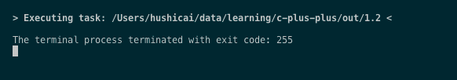
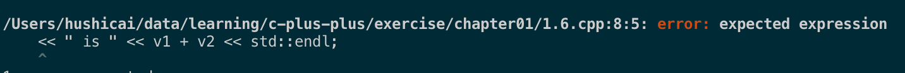

## 练习 1.2

> 改写程序，让它返回-1。返回值-1 通常被当作程序错误的标识。重新编译并运行你的程序，观察你的系统如何处理 main 返回的错误标识。



## 练习 1.6

    解释下面程序片段是否合法。

    std::cout << "The sum of " << v1;
            << " and " << v2;
            << " is " << v1 + v2 << std::endl;

    如果程序是合法的，它的输出是什么？如果程序不合法，原因何在？应该如何修正？

不合法。



移除多余的分号：

```cpp
    std::cout << "The sum of " << v1
              << " and " << v2
              << " is " << v1 + v2 << std::endl;
```
