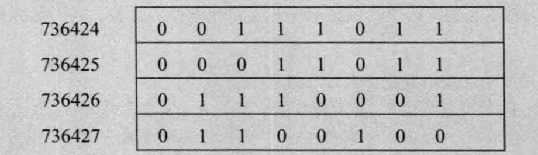

## 2.1 基本内置类型

### 2.1.1 算术类型

**内置类型的机器实现**

大多数计算机以2的整数次幂个比特作为块来处理内存，可寻址的最小内存块称为”字节（byte）“，存储的基本单元称为”字（word）“，它通常由几个字节组成。

大多数计算机中，一个字节由8比特构成，一个字则由32或64比特构成，即4或8字节。

大多数计算机将内存中的每个字节与一个数字（被称为”地址（address）“）关联起来，在一个字节为8比特、字为32比特的机器上，一个字的内存可能如下所示：



其中，左侧是字节的地址，右侧是字节中8比特的具体内容。

**带符号类型**

C++标准并没有规定带符号类型应如何表示，但是约定了在表示范围内正值和负值应该平衡。因此，8比特的signed char理论上应该可以表示-127至127区间内的值，大多数现代计算机将实际的表示范围定为-128（**10000000**）至127（**01111111**）。

**无符号类型**

无符号类型中所有比特都用来存储用来存储值，因此，8比特的unsigned char可以表示0(**00000000**)至255(**11111111**)内的值。

> 大多数现代计算机用**补码**存储整数。

### 2.1.2 类型转换

**取模、取余运算**

不同语言有不同实现标准。

https://en.wikipedia.org/wiki/Modulo_operation

c++遵循：

1. 取余，遵循尽可能让**商向0靠近**的原则
2. 取模，遵循尽可能让**商向负无穷靠近**的原则

所以-1和256取模后的余数：

```
q = -1 / 256 = -1
r = a - nq = -1 - (256 * -1) = 255 
```

其实就相当于该负数加上无符号数的模`-1 + 256 = 255`。

## 2.2 变量

**何为对象？**

对象是具有某种数据类型的内存空间。

**初始值**

在C++中，初始化和赋值是两个完全不同的操作。初始化是指创建变量时赋予其一个初始值，而赋值的含义是把对象的当前值擦除，而已一个新值来替代。

## 2.3 复合类型

**声明语句**

一条声明语句由一个**基本数据类型**和紧随其后的一个**声明符**列表组成。

一条比较复杂的指针或引用声明语句，通常**从右向左**阅读有助于弄清楚它的真实含义，例如：

```cpp
int errNum = 0;
int *const curErr = &errNum;
```

上述例子中，从右往左，离`curErr`最近的符号是`const`，这意味着`curErr`是一个常量对象，对象的类型由声明符的其余部分确定，声明符的下一个符号是`*`，说明`curErr`是一个常量指针，最后，该声明语句的基本数据类型部分确定了常量指针指向的是一个`int`对象。

